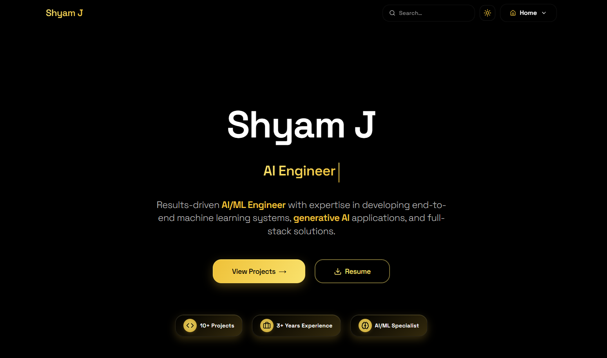

<div align="center">

## ✨ Shyam J – AI/ML Engineer Portfolio


**A modern, production-ready portfolio that showcases AI/ML engineering and full‑stack skills with a focus on performance, UX and storytelling.**

[🚀 Live Demo](https://shyamj.vercel.app) • [📦 Getting Started](#-getting-started) • [💻 Tech Stack](#-tech-stack) • [🤖 AI Terminal](#-ai-terminal) • [📄 Resume Experience](#-resume--certifications)

---

</div>

## 🌟 Overview

This repository contains the source code for **Shyam J’s personal portfolio**, built with the **Next.js App Router** and a fully component‑driven architecture.  
It is designed to be:

- **Fast** – tuned for Core Web Vitals and Lighthouse
- **Expressive** – rich animations and storytelling around AI/ML projects
- **Maintainable** – TypeScript, modular data files, and clean component boundaries
- **Reusable** – easy to fork and adapt for your own portfolio

<div align="center">



_Built with ❤️ using Next.js 16, React 19 and TypeScript_

</div>

---

## ✨ Features

### 🎨 **Design & UX**
- **Modern visual language**: gradients, subtle glassmorphism, and layered depth
- **Dark / light mode** with system preference support using `next-themes`
- **Responsive from day one**: mobile‑first layouts that scale to large displays
- **Clear information hierarchy**: separate sections for experience, projects, skills, leadership and education
- **Accessible by default**: semantic HTML and ARIA‑aware components

### 🚀 **Performance & Architecture**
- **Next.js 16 App Router** with server components where appropriate
- **Code splitting and lazy loading** for heavy sections and animations
- **Optimised static assets** served from `public/`
- **Type‑safe utilities** and data definitions with TypeScript and Zod
- **Post‑install automation** to configure the PDF worker for the internal viewer

### 🎭 **Interactions & Animations**
- **Framer Motion** animations for page sections, cards and micro‑interactions
- **Scroll‑based reveals** to highlight timelines and achievements
- **Interactive navigation** via a feature‑rich `Navbar` with active state and resume link

### 📧 **Contact & Social Presence**
- **Contact section** with validated form and clear error states
- **Dedicated `ContactCard` and `ContactSection` components** for quick reach‑out
- **Prominent links** to GitHub, LinkedIn, email and live portfolio

---

## 🧠 AI Terminal

The home page includes an **AI‑powered terminal** that answers questions about Shyam, projects and experience.  
It is powered by **Groq** and exposed via a typed API route.

- **API route**: `app/api/terminal/route.ts`
- **UI component**: `components/TerminalBot.tsx`
- **Model client**: `groq-sdk` (with overrides for stable `formdata-node`)

### 🔐 Environment Setup

Create `.env.local` in the project root:

```bash
GROQ_API_KEY=your_groq_api_key_here
```

The key is read only on the server via the terminal API – it is **never exposed to the client**.

---

## 📄 Resume & Certifications

The portfolio includes a **dedicated resume experience** with an embedded PDF viewer and quick navigation:

- **Route**: `app/resume`
- **Components**: `PDFViewer`, `PDFViewerInternal`, `AnimatedBackground`
- **Worker config**: `lib/pdfjs-worker-config.ts`

You can also explore **certifications and achievements** using static PDFs in `public/certifications/`.  
This makes it easy for recruiters to validate skills directly from the site.

---

## 🛠 Tech Stack

<div align="center">

| Category        | Technology                                  |
|-----------------|---------------------------------------------|
| **Framework**   | Next.js 16 (App Router)                     |
| **Language**    | TypeScript 5.6                              |
| **Runtime**     | React 19                                    |
| **Styling**     | Tailwind CSS 3.4, `tailwind-merge`, custom CSS |
| **Animations**  | Framer Motion 11                            |
| **Forms**       | React Hook Form + Zod + `@hookform/resolvers` |
| **Theming**     | `next-themes`                               |
| **SEO**         | `next-seo`                                  |
| **AI Backend**  | `groq-sdk`                                  |
| **PDF Viewer**  | `react-pdf`, `pdfjs-dist`                   |
| **Icons**       | `lucide-react`                              |
| **Deployment**  | Vercel                                      |

</div>

---

## 📦 Getting Started

### ✅ Prerequisites

- **Node.js** 18 or later (LTS recommended)
- **npm** (bundled with Node) or another compatible package manager

### 🔧 Installation

```bash
git clone https://github.com/SHYAM140305/shyam-portfolio.git
cd shyam-portfolio

npm install
```

> The `postinstall` hook will automatically run `scripts/copy-pdf-worker.js` to ensure the PDF worker is available in `public/`.

### ▶️ Running Locally

```bash
# Development
npm run dev

# Open in your browser
http://localhost:3000
```

### 🏗 Production Build

```bash
npm run build
npm run start
```

---

## 📁 Project Structure

```bash
shyam-portfolio/
├── app/
│   ├── api/
│   │   └── terminal/
│   │       └── route.ts        # Groq‑powered AI terminal API
│   ├── resume/
│   │   ├── page.tsx            # Resume page with embedded viewer
│   │   └── layout.tsx          # Resume layout shell
│   ├── layout.tsx              # Root layout (theme, fonts, SEO shell)
│   ├── page.tsx                # Main landing page
│   └── globals.css             # Global styles & Tailwind imports
│
├── components/
│   ├── Navbar.tsx              # Top navigation and theme toggle
│   ├── HeroRoleTicker.tsx      # Animated role/skills ticker
│   ├── ProjectsSection.tsx     # Projects grid using ProjectCard
│   ├── ExperienceSection.tsx   # Experience timeline
│   ├── EducationSection.tsx    # Academic timeline
│   ├── LeadershipSection.tsx   # Leadership & extracurriculars
│   ├── CompactSkills.tsx       # Skills overview grid
│   ├── TerminalBot.tsx         # AI terminal UI
│   ├── PDFViewer.tsx           # External PDF viewer wrapper
│   ├── PDFViewerInternal.tsx   # Internal resume PDF viewer
│   ├── ContactSection.tsx      # Contact layout + CTA
│   ├── ContactForm.tsx         # Validated contact form
│   ├── Footer.tsx              # Footer with social links
│   └── ...                     # Other UI building blocks
│
├── data/
│   ├── projects.ts             # Project metadata
│   ├── skills.ts               # Skill taxonomy
│   ├── experience.ts           # Work history
│   ├── education.ts            # Education timeline
│   ├── leadership.ts           # Leadership / extracurriculars
│   ├── hackathons.ts           # Hackathon achievements
│   └── skillIcons.ts           # Icon mapping for skills
│
├── lib/
│   ├── utils.ts                # Shared helpers (e.g. `cn`)
│   ├── useReducedMotion.ts     # Hook to respect reduced‑motion preference
│   └── pdfjs-worker-config.ts  # PDF.js worker configuration
│
├── public/
│   ├── resume.pdf              # Primary resume file
│   ├── portfolio-preview.png   # Preview image used in README
│   ├── certifications/         # Certification PDFs
│   └── icons, logos, favicons  # Brand assets
│
├── scripts/
│   └── copy-pdf-worker.js      # Copies PDF worker into `public/`
│
├── next.config.ts              # Next.js configuration
├── tailwind.config.ts          # Tailwind configuration
├── tsconfig.json               # TypeScript configuration
└── package.json                # Scripts & dependencies
```

---

## 🎨 Customisation Guide

### 🧩 Content & Data

- **`data/projects.ts`**: add or edit project cards (title, description, tech, links)
- **`data/skills.ts`** and **`data/skillIcons.ts`**: update skills and associated icons
- **`data/experience.ts`**, **`data/education.ts`**, **`data/leadership.ts`**, **`data/hackathons.ts`**: tune the narrative to your own journey

### 🖌 Visual Style & Theming

- Tailwind theme tokens live in **`tailwind.config.ts`**
- Global CSS (scrollbars, body, backgrounds, glassmorphism) lives in **`app/globals.css`**
- The theme switcher is wired through **`next-themes`** in layout plus the `ThemeToggle` component

### 📄 Resume & PDFs

- Replace **`public/resume.pdf`** with your own resume file
- Update any resume download links (for example in `Navbar`) if you change the file name
- Add or remove certification PDFs under **`public/certifications/`**

### 📧 Contact Form

The form implementation is built around **React Hook Form + Zod** with client‑side validation.  
You can wire it to the service of your choice:

- Hook it to **FormSubmit**, a custom API route, or any email/SaaS provider
- Update the endpoint and field names in `ContactForm.tsx` accordingly

---

## 📜 Available Scripts

```bash
# Start development server
npm run dev

# Create an optimised production build
npm run build

# Run the production server (after build)
npm run start

# Lint the codebase
npm run lint
```

There is also an implicit script:

- **`postinstall`** – runs `node scripts/copy-pdf-worker.js` to keep the PDF worker in sync.

---

## 🚀 Deployment

### Vercel (Recommended)

This project is **fully optimised for Vercel**, which is also where the live portfolio is hosted.

1. Push your forked repository to GitHub.
2. Go to `https://vercel.com` and import the project.
3. Vercel will auto‑detect **Next.js** and configure the build.
4. Add `GROQ_API_KEY` (and any other secrets) in **Project → Settings → Environment Variables**.
5. Trigger a deploy – your portfolio will be live in a few minutes.

### Other Platforms

The app can also be deployed to:

- **Netlify**, **Render**, **AWS Amplify**, or **Docker‑based** environments  
as long as Node 18+ is available and `npm run build` / `npm run start` are supported.

---

## 🤝 Contributing

While this is primarily a personal portfolio, **ideas, improvements and bug reports are welcome**.

1. Fork the repository
2. Create a feature branch: `git checkout -b feature/my-improvement`
3. Commit your changes: `git commit -m "Improve X"`
4. Push to the branch: `git push origin feature/my-improvement`
5. Open a Pull Request describing what you changed and why

---

## 📄 License

This project is licensed under the **MIT License**.  
See the [`LICENSE`](LICENSE) file for full details.

---

## 📞 Connect

<div align="center">

[](https://shyamj.vercel.app)
[](https://github.com/SHYAM140305)
[](mailto:jshyam2005@gmail.com)
[](https://www.linkedin.com/in/shyam-jayakanthan-050a85284)

---

**⭐ If you find this portfolio useful or inspiring, consider starring the repo! ⭐**

_Made with care by [Shyam J](https://github.com/SHYAM140305)_

</div>


